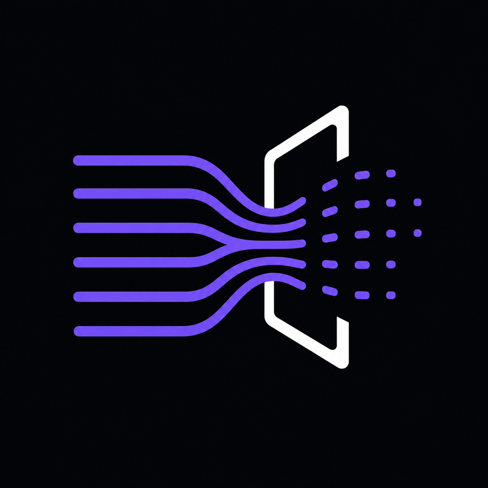

<div align="center">



# WarpShift

### Universal CUDA to ROCm Migration Engine

**The only tool that does not just translate your code. It tells you if it is safe to migrate, proves it compiles, and opens the Pull Request.**

[](https://rocm.docs.amd.com/)
[](https://www.amd.com/en/products/accelerators/instinct/mi300/mi300x.html)
[](https://fastapi.tiangolo.com/)
[](https://nextjs.org/)
[](https://www.docker.com/)
[](LICENSE)

---

**[Quick Start](#quick-start) · [Architecture](#architecture) · [AMD Cloud](#running-on-amd-developer-cloud) · [API Reference](#api-reference)**

</div>

---

## The Problem

Migrating CUDA code to AMD ROCm/HIP is not a find-and-replace operation. It is an **engineering decision** that requires:

- Static risk analysis across thousands of lines of code
- Compile-time validation on the target hardware
- Runtime numerical proof that results match the original
- A structured audit trail for engineering sign-off

Most tools give you a diff. **WarpShift gives you a verdict.**

---

## What WarpShift Does

```
Git Repository URL  -->  [4-Stage Pipeline]  -->  Migration Decision + Proof
```

| Stage | What Happens | Output |
|---|---|---|
| **1. HIPIFY Conversion** | Runs `hipify-clang` or `hipify-perl` on all `.cu` / `.cuh` files | Converted HIP source + diff |
| **2. Static Analysis** | Scans for 15+ known CUDA to ROCm incompatibility patterns | Risk report (HIGH / MED / LOW) |
| **3. Runtime Validation** | Compiles with `hipcc`, runs the binary, validates numerical output | Build status + ms/iter timing |
| **4. AI Explanation Layer** | LLM generates targeted fix guidance per detected risk | Actionable insights per issue |

**Final output:** `PROCEED` or `DO NOT MIGRATE YET` with full evidence.

---

## Quick Start

### Prerequisites

- Docker >= 24.x
- Node.js >= 18.x
- Python >= 3.11
- GitHub CLI (`gh`) for real PR creation (optional)
- An OpenAI-compatible API key for live AI insights (optional)

### 1. Clone and Configure

```bash
git clone https://github.com/diegosantdev/warpshift.git
cd warpshift
```

Create a `.env` file in the project root:

```env
# LLM Integration (supports any OpenAI-compatible endpoint)
MIGRATEAI_LLM_API_KEY=your_api_key_here
MIGRATEAI_VLLM_URL=https://api.groq.com/openai/v1/chat/completions
MIGRATEAI_VLLM_MODEL=llama3-8b-8192

# Execution Mode
MIGRATEAI_BACKEND_MODE=real        # "mock" for safe demo, "real" for full pipeline
WARPSHIFT_EXECUTION_MODE=host      # "host" or "docker" for sandboxed execution

# GitHub PR Automation (requires gh auth login)
GITHUB_REAL_PR=false               # set to "true" to enable real PR creation
GITHUB_DEFAULT_BASE_BRANCH=main
```

### 2. Start the Backend

```bash
cd backend
python -m venv venv
source venv/bin/activate           # Windows: venv\Scripts\activate
pip install -r requirements.txt
uvicorn app.main:app --reload --port 8000
```

### 3. Start the Frontend

```bash
cd frontend
npm install
npm run dev
```

Open **http://localhost:3000**, paste any CUDA repository URL and click **MIGRATE**.

---

## Architecture

```
+----------------------------------------------------------------------+
|                        WarpShift Engine                              |
|                                                                      |
|   +-----------+   +------------+   +------------+   +------------+  |
|   |  HIPIFY   |-->|   Static   |-->|  Runtime   |-->|     AI     |  |
|   |  Stage    |   |  Analysis  |   |   Build    |   |  Insights  |  |
|   +-----------+   +------------+   +------------+   +------------+  |
|        |                |                |                |          |
|        +----------------+----------------+----------------+          |
|                                  |                                   |
|                                  v                                   |
|         +------------------------------------------------+           |
|         |          Evidence Engine  (evidence.json)      |           |
|         |  run_id  commit  stage_logs  risk_items        |           |
|         |  build_status  validation_result  ai_insights  |           |
|         +------------------------------------------------+           |
|                                  |                                   |
|                  +---------------+---------------+                   |
|                  v                               v                   |
|      +---------------------+       +----------------------+          |
|      |     Decision OS     |       |   GitHub PR Flow     |          |
|      |  PROCEED / DO NOT   |       |  branch + push + pr  |          |
|      +---------------------+       +----------------------+          |
+----------------------------------------------------------------------+
```

### Repository Structure

```
warpshift/
├── backend/
│   ├── app/
│   │   ├── main.py              # FastAPI routes + SSE streaming
│   │   ├── pipeline.py          # 4-stage orchestration engine
│   │   ├── stages.py            # Stage logic + LLM call
│   │   ├── schemas.py           # Pydantic models
│   │   ├── settings.py          # Environment configuration
│   │   └── real_anchor.py       # Reference artifact computation
│   ├── docker_executor.py       # Isolated Docker sandbox runner
│   └── scripts/
│       └── docker_entrypoint.py # Container-side executor
├── frontend/
│   └── app/
│       ├── page.tsx             # Decision OS UI
│       └── globals.css          # Glassmorphism design system
├── data/
│   └── benchmark_sample/
│       ├── main.cu              # SAXPY benchmark (CUDA/HIP dual-mode)
│       └── Makefile
└── Dockerfile                   # AMD ROCm-ready sandbox image
```

---

## SAXPY Benchmark

WarpShift bundles a real GPU benchmark (`data/benchmark_sample/main.cu`) that:

1. Allocates 1M float elements on GPU
2. Runs 100 iterations of SAXPY: `Y[i] = 2.0 * X[i] + Y[i]`
3. Validates numerical correctness against CPU-computed expected values (`maxError < 1e-5`)
4. Reports wall-clock time in ms/iter

```
[WARPSHIFT_BENCHMARK] time_ms=0.231
[WARPSHIFT_VALIDATION] status=SUCCESS
```

This is parsed automatically and surfaced in the **SAXPY Benchmark (GPU Validated)** tab in the UI.

The same kernel compiles with both `nvcc` (CUDA) and `hipcc` (ROCm) via a compile-time flag:

```cpp
#ifndef __HIP_PLATFORM_AMD__
#include <cuda_runtime.h>
#else
#include <hip/hip_runtime.h>
#endif
```

---

## Running on AMD Developer Cloud

WarpShift was built and validated to run on **AMD Instinct MI300X** hardware.

### Deploy to AMD Cloud

```bash
# SSH into your AMD Developer Cloud instance, then:

git clone https://github.com/diegosantdev/warpshift.git
cd warpshift

export MIGRATEAI_BACKEND_MODE=real
export MIGRATEAI_LLM_API_KEY=your_key
export WARPSHIFT_EXECUTION_MODE=host

cd backend
pip install -r requirements.txt
nohup uvicorn app.main:app --host 0.0.0.0 --port 8000 &

# On your local machine, tunnel the ports:
ssh -L 3000:localhost:3000 -L 8000:localhost:8000 user@amd-cloud-ip
```

Then open `http://localhost:3000` on your local browser. The analysis runs on AMD silicon.

### Build the Docker Sandbox

```bash
docker build -t warpshift-runner:latest .

docker run --rm \
  -e WARPSHIFT_EXECUTION_MODE=docker \
  -e MIGRATEAI_BACKEND_MODE=real \
  -v /tmp/workspace:/workspace \
  warpshift-runner:latest
```

---

## API Reference

| Method | Endpoint | Description |
|---|---|---|
| `POST` | `/analyze` | Run full migration analysis |
| `GET` | `/analyze/stream?github_url=...` | Real-time SSE stream of stage progress |
| `GET` | `/runs/{run_id}` | Retrieve full evidence JSON for a run |
| `POST` | `/runs/{run_id}/create-pr` | Create real GitHub PR with converted code |
| `GET` | `/history` | List of past analysis runs |
| `GET` | `/demo-repos` | Curated demo repository candidates |
| `POST` | `/export/risk-report` | Export risk report as JSON or Markdown |
| `GET` | `/anchor/status` | Reference artifact validation status |

### Example Request

```bash
curl -X POST http://localhost:8000/analyze \
  -H "Content-Type: application/json" \
  -d '{"github_url": "https://github.com/NVIDIA/cuda-samples", "mode": "live"}'
```

### Real-time Streaming

```javascript
const source = new EventSource(
  'http://localhost:8000/analyze/stream?github_url=https://github.com/NVIDIA/cuda-samples'
);
source.addEventListener('stage_update', (e) => console.log(JSON.parse(e.data)));
source.addEventListener('completed', (e) => console.log('Done!', JSON.parse(e.data)));
```

---

## Demo Playbook

> Perfect for a live 2-minute demonstration.

1. Open `http://localhost:3000`
2. Paste `https://github.com/NVIDIA/cuda-samples` in the URL field
3. Click `MIGRATE` and watch the 4 stages run in real time (20 to 35 seconds)
4. Open the Risk Report tab and point out HIGH risks with their detection sources
5. Open the SAXPY Benchmark tab and show numerical validation status and ms/iter timing
6. Show the Decision Banner: `PROCEED WITH CAUTION` or `DO NOT MIGRATE YET`
7. Click `Publish Real PR to GitHub` and watch the real GitHub PR open in the browser

Total elapsed: **under 90 seconds.** Full end-to-end migration decision with proof.

---

## Detected Risk Patterns

WarpShift's static analysis engine scans for:

| Risk | Severity | Detection |
|---|---|---|
| Hardcoded `warpSize = 32` | HIGH | Static scan |
| `cuBLAS` argument ordering | HIGH | Dependency scan |
| Dynamic kernel launches | HIGH | AST pattern |
| `cuDNN` custom ops | MEDIUM | Dependency scan |
| Texture memory usage | MEDIUM | Static scan |
| `__device__` function pointers | MEDIUM | AST pattern |
| PTX inline assembly | HIGH | Static scan |
| Cooperative groups | MEDIUM | Dependency scan |
| `cudaGraph` / CUDA Graphs | MEDIUM | Static scan |
| Thrust algorithms | LOW | Dependency scan |

---

## Contributing

Pull requests are welcome. For major changes, please open an issue first to discuss what you would like to change.

```bash
git checkout -b feature/my-improvement
git commit -m "feat: describe your change"
git push origin feature/my-improvement
```

---

## License

MIT License. Copyright 2026 Diego Sant.

Built for the AMD Developer Cloud Hackathon.

---

<div align="center">

Built to make AMD ROCm adoption dead simple.

*WarpShift - from CUDA to HIP in under 90 seconds.*

</div>
